# Generating Data — Python Project

This project was built while following *Python Crash Course* by Eric Matthes.

---

## Chapter 15 — GENERATING DATA

### Installing Matplotlib

---

### Plotting a Simple Line Graph

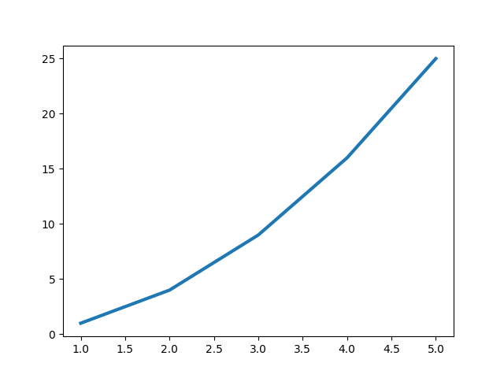  
*Figure 15-1: One of the simplest plots you can make in Matplotlib*

---

### Changing the Label Type and Line Thickness

  
*Figure 15-2: The chart is much easier to read now.*

---

### Correcting the Plot

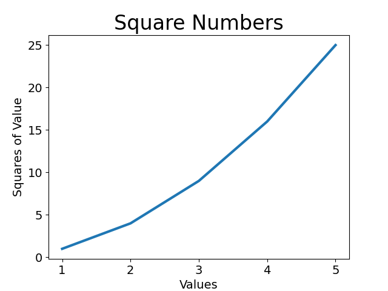  
*Figure 15-3: The data is now plotted correctly.*

---

### Using Built-in Styles

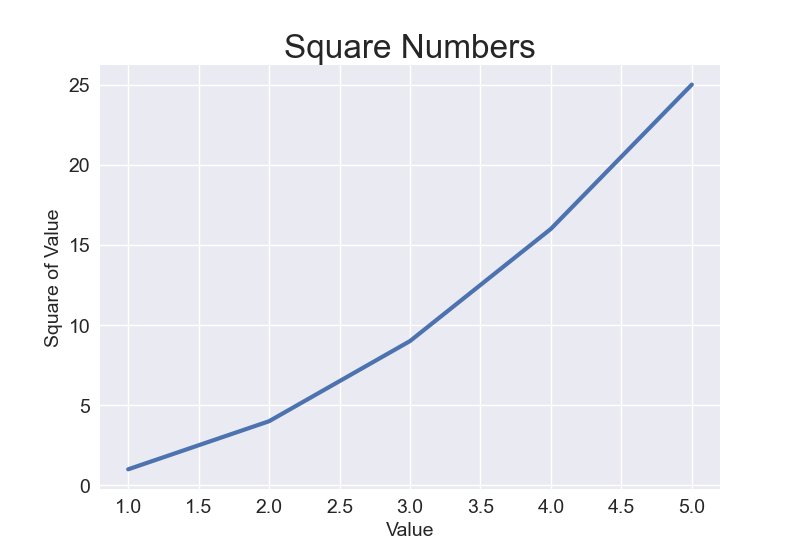  
*Figure 15-4: The built-in seaborn style*

---

### Plotting and Styling Individual Points with scatter()

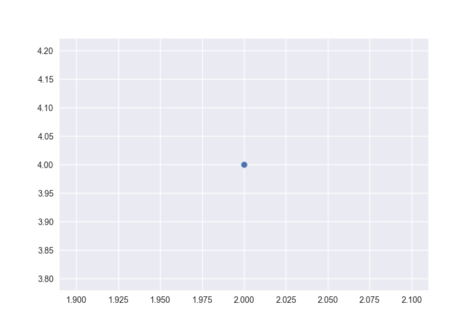  
*Figure 15-5: Plotting a single point*

---

### Plotting a Series of Points with scatter()

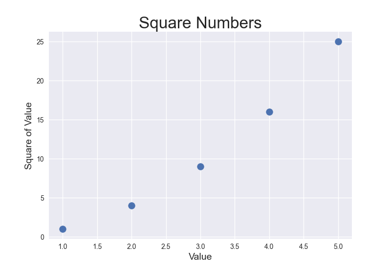  
*Figure 15-6: A scatter plot with multiple points*

---

### Calculating Data Automatically

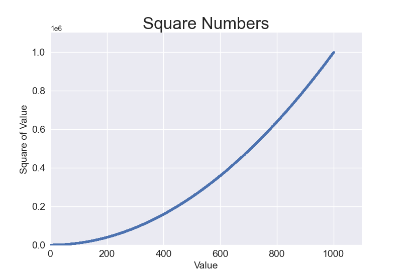  
*Figure 15-7: Python can plot 1,000 points as easily as it plots 5 points.*

---

### Customizing Tick Labels / Colors / Colormap

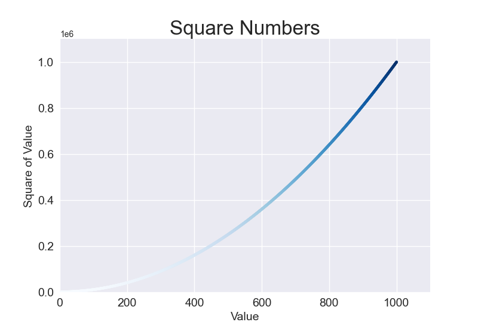  
*Figure 15-8: A plot using the Blues colormap*

---

### Saving Your Plots Automatically

---

### Random Walks

- Creating the `RandomWalk` Class  
- Choosing Directions  
- Plotting the Random Walk  

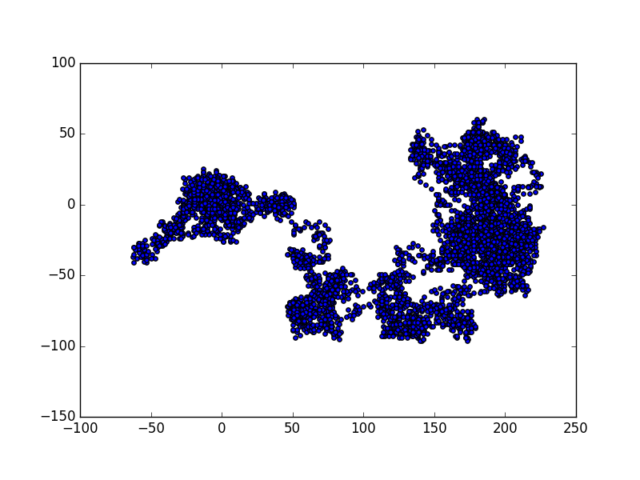  
*Figure 15-9: A random walk with 5,000 points*

- Generating Multiple Random Walks  
- Styling the Walk  
- Coloring the Points  

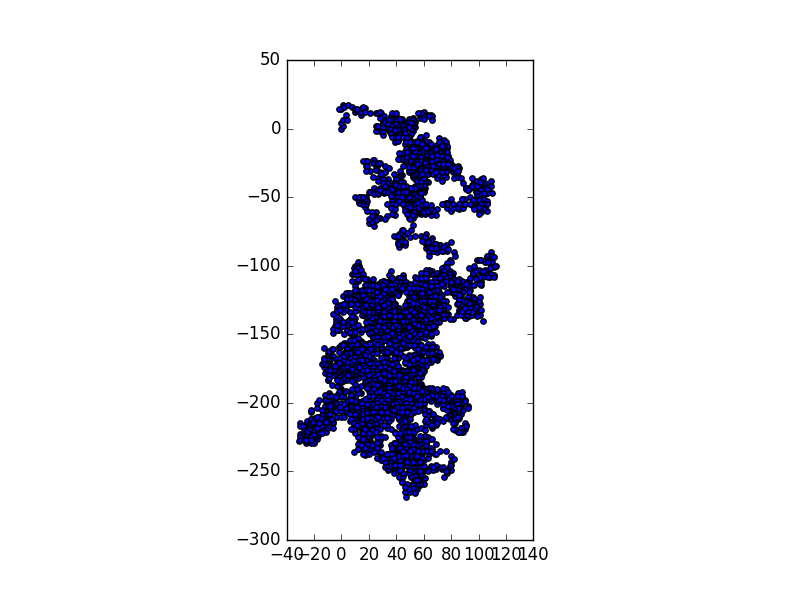  
*Figure 15-10: A random walk colored with the Blues colormap*

- Plotting the Starting and Ending Points  
- Cleaning Up the Axes  
- Adding Plot Points  

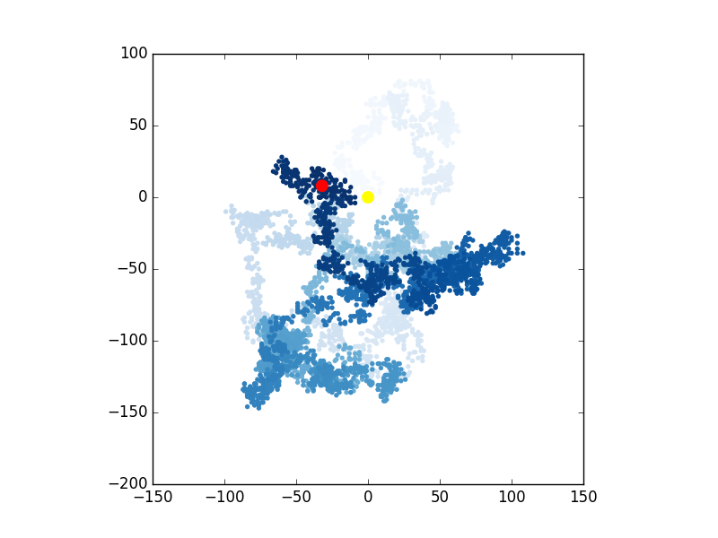  
*Figure 15-11: A walk with 50,000 points*

- Altering the Size to Fill the Screen  

---

### Rolling Dice with Plotly

- Installing Plotly  
  - `pip install plotly`  
  - `pip install pandas`  
- Creating the `Die` Class  
- Rolling the Die  
- Analyzing the Results  
- Making a Histogram  

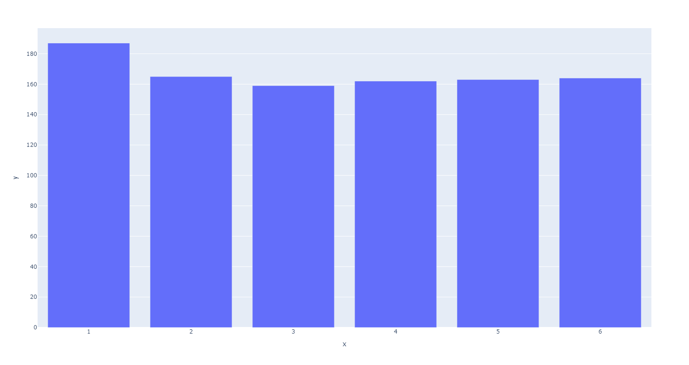  
*Figure 15-12: The initial plot produced by Plotly Express*

- Customizing the Plot  

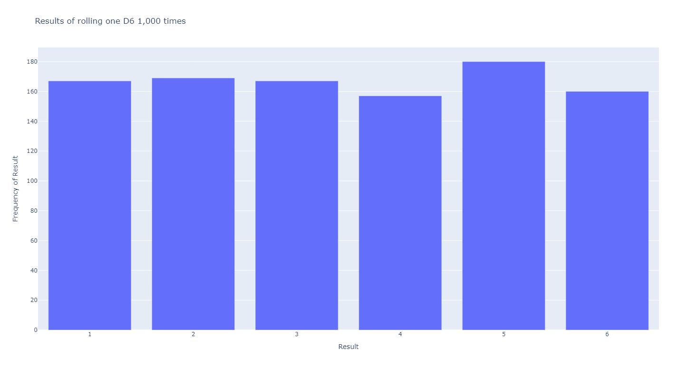  
*Figure 15-13: A simple bar chart created with Plotly*

- Rolling Two Dice  

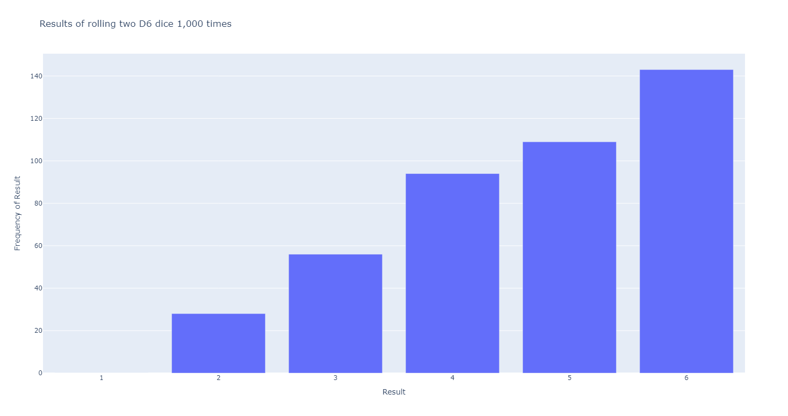  
*Figure 15-14: Simulated results of rolling two six-sided dice 1,000 times*

- Further Customizations  
- Rolling Dice of Different Sizes  

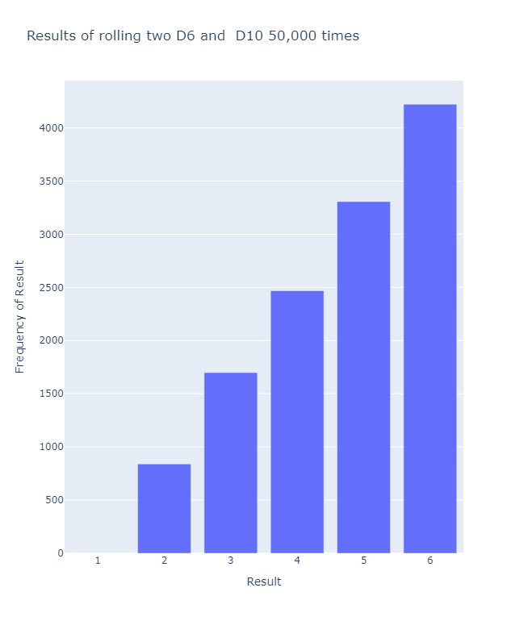  
*Figure 15-15: The results of rolling a six-sided die and a ten-sided die 50,000 times*

- Saving Figures  

---

### Link to the Project Code

[Generating Data GitHub Repository](https://github.com/jeanmarc-webdev/generating-data)